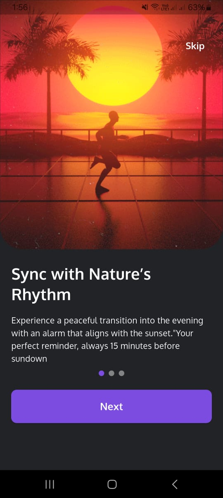
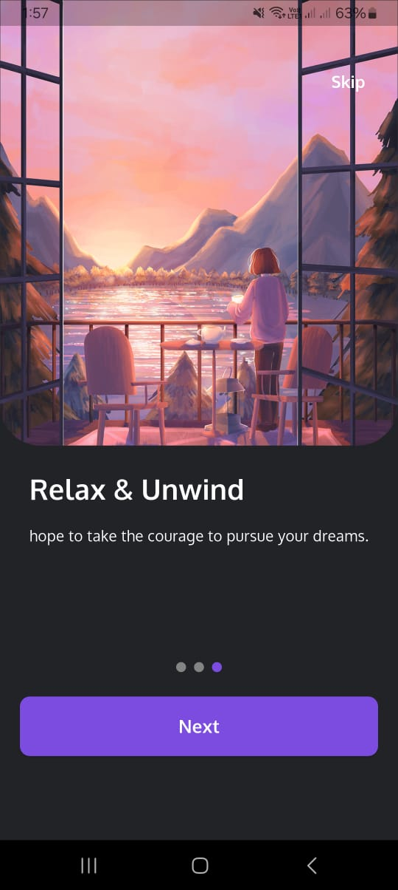
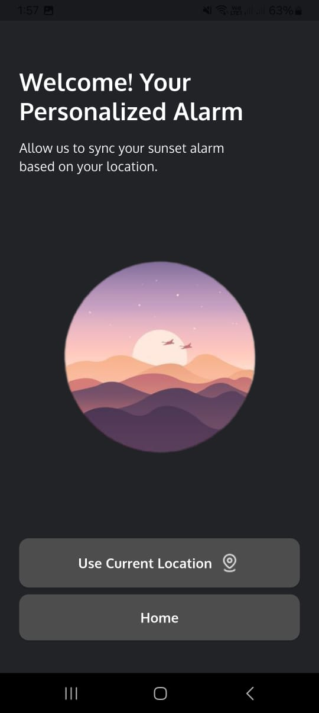
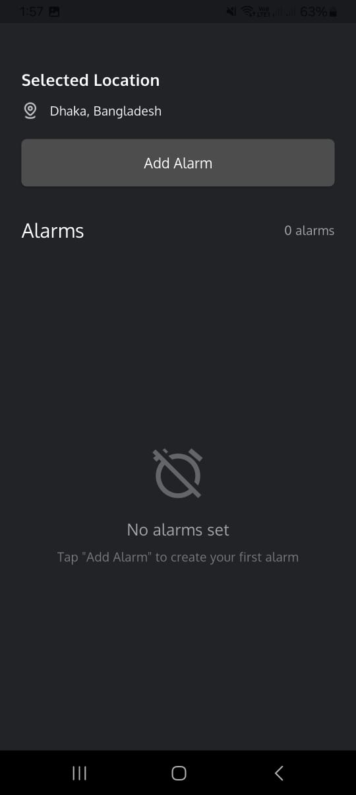
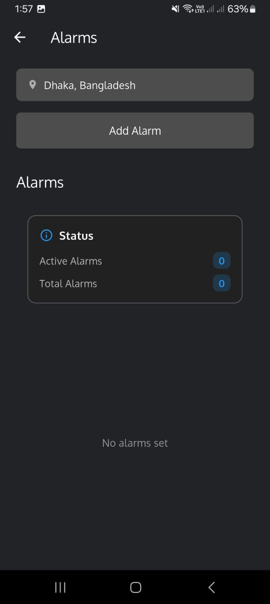
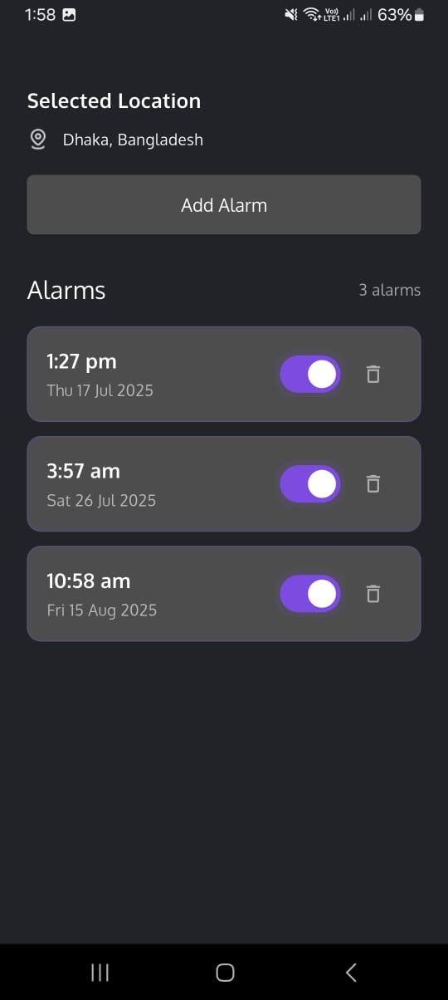
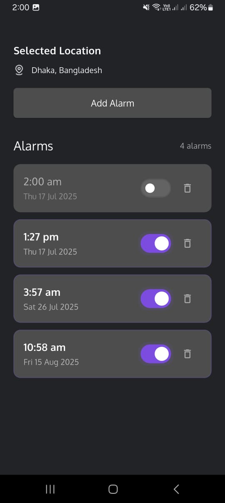

# Wakey - Personalized Alarm App

A beautiful and intelligent alarm app that syncs with your location to provide personalized wake-up experiences. Built with Flutter for cross-platform compatibility.

## 🌟 Features

- **Smart Onboarding**: 3-screen onboarding flow with skip functionality
- **Location-Based Alarms**: Personalized alarms based on your location
- **Rich Notifications**: Advanced notification system with snooze options
- **Local Storage**: Persistent alarm data with Hive database
- **Background Processing**: Reliable alarm management even when app is closed
- **Modern UI**: Clean, responsive design matching provided specifications
- **Cross-Platform**: Works on Android and iOS

## 📱 Screenshots

Here are some screenshots showcasing the app's features:

### Onboarding Flow

<div align="center">
  
  
  
</div>

### Location & Alarm Management

<div align="center">
  
  
  
</div>

### Alarm Features

<div align="center">
  
  
</div>

### Key Features Shown:

- **Onboarding**: Interactive screens with skip functionality
- **Location Access**: Permission handling with user-friendly interface
- **Alarm Management**: Easy alarm creation and management
- **Modern UI**: Clean, dark theme with responsive design
- **Notification System**: Rich notifications with multiple actions

## 🚀 Getting Started

### Prerequisites

Before you begin, ensure you have the following installed:

- **Flutter SDK**: Version 3.8.1 or higher
- **Dart SDK**: Version 3.8.1 or higher
- **Android Studio** (for Android development)
- **Xcode** (for iOS development - macOS only)
- **Visual Studio Code** (recommended IDE)

### Installation

1. **Clone the repository**

   ```bash
   git clone https://github.com/syedraihanali/wakey.git
   cd wakey
   ```

2. **Install dependencies**

   ```bash
   flutter pub get
   ```

3. **Generate required files**

   ```bash
   flutter packages pub run build_runner build
   ```

4. **Run the app**

   ```bash
   flutter run
   ```

### Platform-Specific Setup

#### Android Setup

1. Open `android/app/src/main/AndroidManifest.xml`
2. Ensure the following permissions are present:

   ```xml
   <uses-permission android:name="android.permission.ACCESS_FINE_LOCATION" />
   <uses-permission android:name="android.permission.ACCESS_COARSE_LOCATION" />
   <uses-permission android:name="android.permission.WAKE_LOCK" />
   <uses-permission android:name="android.permission.VIBRATE" />
   <uses-permission android:name="android.permission.RECEIVE_BOOT_COMPLETED" />
   <uses-permission android:name="android.permission.SCHEDULE_EXACT_ALARM" />
   ```

#### iOS Setup

1. Open `ios/Runner/Info.plist`
2. Add location usage descriptions:

   ```xml
   <key>NSLocationWhenInUseUsageDescription</key>
   <string>This app needs location access to personalize your alarms.</string>
   ```

## 🛠️ Tools & Packages Used

### Core Framework

- **Flutter**: `^3.8.1` - Cross-platform UI framework
- **Dart**: `^3.8.1` - Programming language

### State Management

- **GetX**: `^4.7.2` - State management and navigation

### UI Components

- **Cupertino Icons**: `^1.0.8` - iOS-style icons
- **Smooth Page Indicator**: `^1.2.1` - Onboarding page indicators

### Location Services

- **Geolocator**: `^14.0.2` - Location positioning
- **Geocoding**: `^4.0.0` - Address geocoding

### Notifications

- **Flutter Local Notifications**: `^19.3.0` - Local notification system
- **Timezone**: `^0.10.1` - Timezone handling for notifications

### Data Storage

- **Hive**: `^2.2.3` - Lightweight NoSQL database
- **Hive Flutter**: `^1.1.0` - Flutter integration for Hive

### Development Tools

- **Flutter Lints**: `^6.0.0` - Dart linting rules
- **Hive Generator**: `^2.0.1` - Code generation for Hive

### Additional Utilities

- **Solar Calculator**: `^1.0.3` - Sunrise/sunset calculations

## 📁 Project Structure

```
lib/
├── main.dart                 # App entry point
├── version.dart             # App version information
├── constants/               # App constants
│   ├── image_strings.dart   # Image asset paths
│   ├── text_strings.dart    # Text constants
│   └── text_theme.dart      # Theme and styling
├── features/                # Feature modules
│   ├── alarm/              # Alarm functionality
│   │   ├── alarm.dart      # Alarm data model
│   │   ├── alarm_storage.dart # Local storage
│   │   ├── alarm_notifications.dart # Notification system
│   │   ├── alarm_ui.dart   # Alarm creation UI
│   │   └── alarm_widget.dart # Alarm list item
│   ├── home/               # Home screen
│   │   └── screens/
│   ├── onboarding/         # Onboarding flow
│   │   ├── screens/
│   │   ├── widgets/
│   │   └── controller/
│   ├── permissions/        # Location permissions
│   │   └── lp_screen.dart
│   └── splash/             # Splash screen
│       └── splash_screen.dart
├── helpers/                # Helper functions
│   └── helper_func.dart
└── assets/                 # Static assets
    ├── images/            # Image files
    └── fonts/             # Custom fonts
```

## 🔧 Configuration

### Environment Setup

1. Ensure Flutter is properly installed and configured
2. Set up Android SDK and/or Xcode for target platforms
3. Configure IDE with Flutter and Dart plugins

### Database Initialization

The app uses Hive for local storage. Database initialization happens automatically on first run.

### Notification Setup

Notifications are configured automatically, but users will be prompted for permissions on first use.

## 🏗️ Building for Production

### Android APK

```bash
flutter build apk --release
```

### Android App Bundle

```bash
flutter build appbundle --release
```

### iOS

```bash
flutter build ios --release
```

### Web

```bash
flutter build web --release
```

## 🧪 Testing

### Run Tests

```bash
flutter test
```

### Code Analysis

```bash
flutter analyze
```

### Format Code

```bash
flutter format .
```

## 📋 Pre-release Checklist

- [ ] Run `flutter test` - All tests pass
- [ ] Run `flutter analyze` - No issues found
- [ ] Run `flutter format .` - Code is properly formatted
- [ ] Test on physical devices (Android/iOS)
- [ ] Verify notification permissions work
- [ ] Test location services functionality
- [ ] Ensure alarms trigger correctly
- [ ] Test background app behavior

## 🚀 Deployment

### Android Play Store

1. Build signed APK/AAB
2. Upload to Google Play Console
3. Configure app listing and metadata

### iOS App Store

1. Build for iOS release
2. Upload to App Store Connect
3. Submit for review

## 🐛 Troubleshooting

### Common Issues

1. **Location not working**: Ensure location permissions are granted
2. **Notifications not showing**: Check notification permissions in device settings
3. **Alarms not triggering**: Verify exact alarm permissions (Android 12+)
4. **Build errors**: Run `flutter clean` and `flutter pub get`

### Debug Mode

For debugging, uncomment debug prints in development builds.

## 📝 License

This project is licensed under the MIT License - see the LICENSE file for details.

## 🤝 Contributing

1. Fork the repository
2. Create a feature branch
3. Commit your changes
4. Push to the branch
5. Create a Pull Request

## 📞 Support

For support and questions:

- Create an issue in the GitHub repository
- Check the troubleshooting section above

## 📈 Version History

### v1.0.0 (Current)

- Initial release
- Complete onboarding flow
- Location-based alarm personalization
- Local storage with Hive database
- Rich notification system
- Background service for alarm management
- Clean, modern UI
- Production-ready code

---
